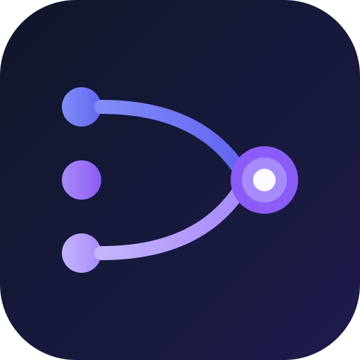

<p align="center">
  
</p>

# Local AI Proxy

**[English](README.md)** | **[中文](#功能特性)**

统一的 AI API 网关，让任何应用通过 `http://localhost:3199` 接入本地 AI 模型 — 同时兼容 **OpenAI** 和 **Anthropic** API 格式。支持 Claude、Gemini、Copilot、Ollama、LM Studio 等。

> **一个地址，所有模型。** 应用只需将 API 指向 `http://localhost:3199`，即可像调用 OpenAI API 一样使用各种本地 AI，无需分别对接不同服务。

## 快速开始

### 方式一：下载预编译包（推荐）

从 [GitHub Releases](https://github.com/lixuanxian/local-ai-proxy/releases) 下载适合你平台的最新版本：

| 平台 | 下载文件 |
|---|---|
| Windows (x64) | `local-ai-proxy-win.zip` |
| macOS (Apple Silicon) | `local-ai-proxy-mac-arm64.zip` |
| macOS (Intel) | `local-ai-proxy-mac-x64.zip` |
| Linux (x64) | `local-ai-proxy-linux.zip` |

解压即用，无需安装。启动后自动进入系统托盘，并在浏览器中打开 `http://localhost:3199`。

### 方式二：从源码运行

```bash
git clone https://github.com/lixuanxian/local-ai-proxy.git
cd local-ai-proxy
npm run setup   # 安装依赖 + 构建前端
npm start       # 启动服务 http://localhost:3199
```

## 功能特性

- **双 API 兼容** — 同时支持 OpenAI (`/v1/chat/completions`) 和 Anthropic (`/v1/messages`) 格式
- **多提供者** — CLI 类（Claude、Gemini、Copilot）和 API 类（Ollama、LM Studio、OpenAI 兼容、Anthropic 兼容、Gemini API）
- **智能路由** — 根据模型名自动匹配提供者，也可手动指定
- **流式输出** — 两种 API 格式均支持 SSE 流式传输
- **内置聊天** — 对话式 AI 界面，支持流式输出、文件上传、技能、角色和 MCP 工具调用
- **MCP 集成** — [Model Context Protocol](https://modelcontextprotocol.io/) 支持，在聊天中使用外部工具
- **Web 管理面板** — 提供者管理、请求日志、Token 用量统计、应用快捷入口
- **身份认证** — 可选的 API Token 和 Session 认证
- **CORS 管理** — 可配置全部允许或按源审批
- **系统托盘** — 后台运行，托盘图标，自动打开浏览器

## 支持的提供者

| 提供者 | 类型 | 工作方式 |
|---|---|---|
| Claude CLI | CLI | 调用本地 `claude` 进程 |
| Gemini CLI | CLI | 调用本地 `gemini` 进程 |
| GitHub Copilot | CLI | 调用本地 `copilot` 进程 |
| Ollama | API | 代理到本地 Ollama 服务 |
| LM Studio | API | 代理到本地 LM Studio 服务 |
| OpenAI 兼容 | API | 任何 OpenAI 兼容端点（vLLM、text-generation-webui 等） |
| Anthropic 兼容 | API | 任何 Anthropic 兼容端点 |
| Gemini API | API | Google AI Studio REST API |

可通过 Web 管理面板添加、配置和测试提供者。

### CLI 提供者的前置条件

如需使用 CLI 类提供者，请先安装对应工具：

- **Claude CLI** — `npm install -g @anthropic-ai/claude-code`（[文档](https://github.com/anthropics/claude-code)）
- **Gemini CLI** — `npm install -g @google/gemini-cli`（[文档](https://github.com/google/gemini-cli)）
- **GitHub Copilot** — `npm install -g @github/copilot`（[文档](https://github.com/features/copilot/cli)）

API 类提供者（Ollama、LM Studio 等）只需运行对应服务，在管理面板中配置 URL 即可。

## 使用方法

### 接入你的应用

将任何 OpenAI 兼容客户端的 API 地址指向 `http://localhost:3199`：

```python
# Python（openai 包）
from openai import OpenAI

client = OpenAI(base_url="http://localhost:3199/v1", api_key="optional")
response = client.chat.completions.create(
    model="claude",
    messages=[{"role": "user", "content": "你好！"}]
)
```

```javascript
// JavaScript（fetch）
const response = await fetch("http://localhost:3199/v1/chat/completions", {
  method: "POST",
  headers: { "Content-Type": "application/json" },
  body: JSON.stringify({
    model: "claude",
    messages: [{ role: "user", content: "你好！" }]
  })
});
```

```bash
# cURL
curl http://localhost:3199/v1/chat/completions \
  -H "Content-Type: application/json" \
  -d '{"model":"claude","messages":[{"role":"user","content":"你好！"}]}'

# 流式输出
curl http://localhost:3199/v1/chat/completions \
  -H "Content-Type: application/json" \
  -d '{"model":"llama3","stream":true,"messages":[{"role":"user","content":"你好！"}]}'

# Anthropic 格式
curl http://localhost:3199/v1/messages \
  -H "Content-Type: application/json" \
  -d '{"model":"claude-sonnet-4-6","messages":[{"role":"user","content":"你好！"}]}'
```

### 智能模型路由

代理根据模型名自动选择提供者：

| 模型名模式 | 路由到 |
|---|---|
| `claude-*`、`claude` | Claude CLI |
| `gemini-*`、`gemini` | Gemini CLI 或 Gemini API |
| `gpt-*`、`llama*`、`mistral*` | OpenAI 兼容（Ollama、LM Studio 等） |
| `copilot` | GitHub Copilot |

也可以显式指定提供者：`"provider": "ollama"`。

### API 端点

| 方法 | 路径 | 说明 |
|---|---|---|
| POST | `/v1/chat/completions` | 聊天（OpenAI 格式） |
| POST | `/v1/messages` | 聊天（Anthropic 格式） |
| GET | `/v1/models` | 列出可用模型 |

## Web 管理面板

访问 **http://localhost:3199** 可以：

- **仪表盘** — 查看请求统计、Token 用量图表、提供者状态
- **聊天** — 内置对话 AI，支持流式输出、文件上传、角色设定和 MCP 工具调用
- **提供者** — 添加、编辑、测试、启停提供者
- **日志** — 搜索、筛选、导出请求日志
- **应用** — 管理应用快捷卡片
- **设置** — 配置认证、CORS、MCP 服务器、快捷键、API Token

## MCP 工具集成

内置聊天支持 [Model Context Protocol](https://modelcontextprotocol.io/)，可在 AI 对话中调用外部工具：

- 在 **设置 > MCP 服务器** 中添加（支持 HTTP 和 SSE 传输）
- 工具自动发现，在聊天中直接可用
- 工具调用和结果在对话中内联展示
- 支持迭代式工具调用（每条消息最多 10 轮）

## 配置

### 环境变量

| 变量 | 默认值 | 说明 |
|---|---|---|
| `PORT` | `3199` | 服务端口 |
| `DEFAULT_PROVIDER` | `claude-cli` | 无匹配时的默认提供者 |
| `OPENAI_BASE_URL` | `http://localhost:1234` | 默认 OpenAI 兼容 API 地址 |
| `OPENAI_API_KEY` | _（空）_ | OpenAI 兼容后端的 API 密钥 |

### config.json

在可执行文件旁放置 `config.json` 可预配置提供者和设置，无需通过 Web 界面：

```json
{
  "port": 3199,
  "providers": [
    {
      "name": "Claude CLI",
      "type": "claude-cli",
      "enabled": true,
      "is_default": true
    },
    {
      "name": "Ollama",
      "type": "openai-api",
      "base_url": "http://localhost:11434/v1",
      "enabled": true
    }
  ],
  "settings": {
    "auth_enabled": "false",
    "cors_mode": "allow_all",
    "logging_enabled": "true"
  }
}
```

### 身份认证

默认关闭认证。启用方法：

1. 打开 Web 管理面板的 **设置**
2. 开启 **身份认证**
3. 首次登录时设置管理员账号

启用后，API 请求需携带 Bearer Token：`Authorization: Bearer your-api-token`。

## 参与贡献

开发配置、构建说明和架构细节请参阅 [CONTRIBUTING.md](CONTRIBUTING.md)。

## 许可证

MIT
